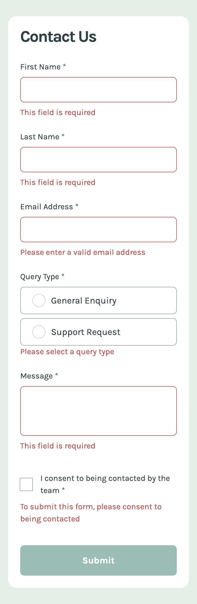
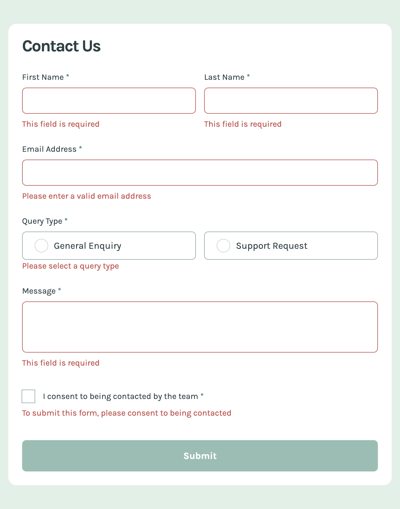
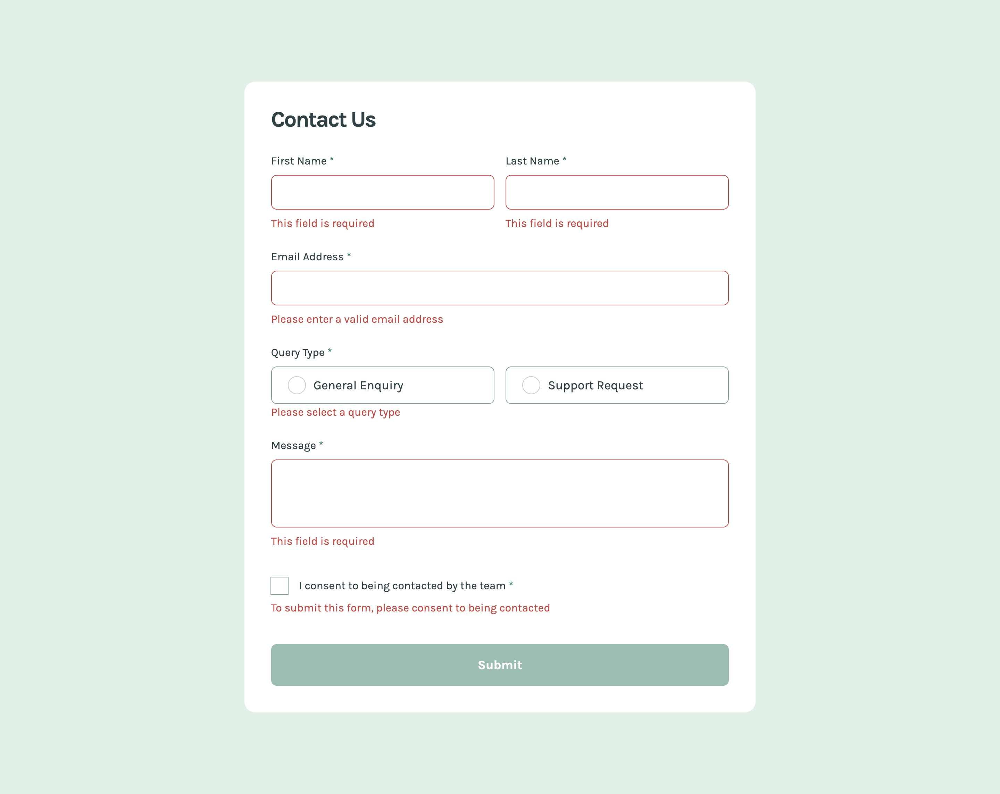

# Frontend Mentor - Contact form solution

This is a solution to the [Contact form challenge on Frontend Mentor](https://www.frontendmentor.io/challenges/contact-form--G-hYlqKJj). Frontend Mentor challenges help you improve your coding skills by building realistic projects.

## Table of contents

- [Frontend Mentor - Contact form solution](#frontend-mentor---contact-form-solution)
  - [Table of contents](#table-of-contents)
  - [Overview](#overview)
    - [The challenge](#the-challenge)
    - [Screenshot](#screenshot)
    - [Links](#links)
  - [My process](#my-process)
    - [Built with](#built-with)
    - [What I learned](#what-i-learned)
    - [Continued development](#continued-development)
    - [Useful resources](#useful-resources)

## Overview

### The challenge

Users should be able to:

- Complete the form and see a success toast message upon successful submission
- Receive form validation messages if:
  - A required field has been missed
  - The email address is not formatted correctly
- Complete the form only using their keyboard
- Have inputs, error messages, and the success message announced on their screen reader
- View the optimal layout for the interface depending on their device's screen size
- See hover and focus states for all interactive elements on the page

### Screenshot

Mobile

Tablet

Desktop

### Links

- [Live Site URL](https://contact-form.frilly.dev)

## My process

### Built with

- [Tailwind CSS](https://tailwindcss.com/)
- [Astro](https://astro.build/)
- [SolidJS](https://www.solidjs.com/)
- [Sass](https://sass-lang.com/)

### What I learned

I (somewhat) learned how to focus a div element with proper role and tabindex attributes? Seems very difficult, as the whole dialog wasn't announced, but at least the main heading was. I need more practice with this.

### Continued development

Definitely feel like I need to practice more with accessibility. I'm not sure how to make the whole dialog focusable, but I'll figure it out eventually. I never thought about the concept of accessibility, but I'm glad I'm learning about it now.

### Useful resources

- [Web ARIA Alert Box](https://www.w3.org/WAI/ARIA/apg/patterns/alert/examples/alert/) - This didn't seem to help VoiceOver much, but it worked for the heading announce.
